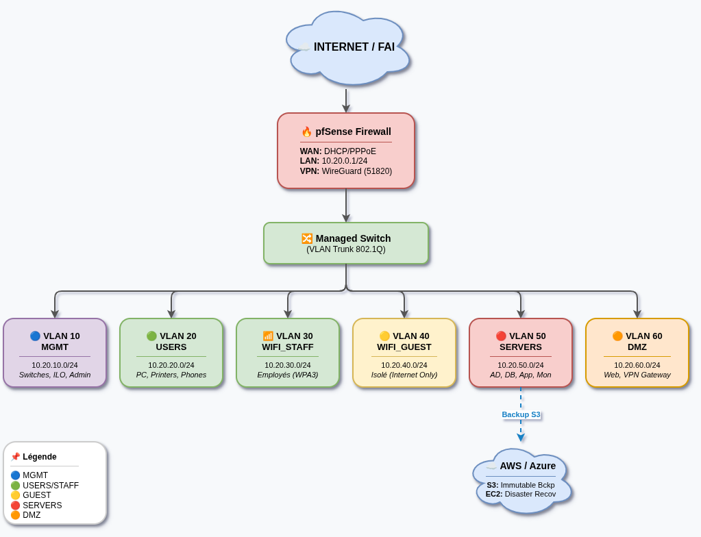

# 🎓 Ynov B3 INFRA - Projet Smart Office

## 📋 Présentation du Projet

**Formation:** Ynov Informatique - Bachelor 3  
**UF:** INFRA - Infrastructure & Réseau  
**Sujet:** Smart Office  
**Équipe:** []  
**Période:** [] - []  

### 🎯 Contexte Pédagogique

Ce projet simule la conception d'une infrastructure IT pour une startup française en hyper-croissance qui emménage dans un nouveau siège de 4 étages.

**Objectif pédagogique:** Mobiliser les compétences acquises en:
- Architecture réseau (LAN/WLAN/VLAN/VPN)
- Sécurité (Zero Trust, Pare-feu, SIEM)
- Cloud hybride (On-Premise + AWS/Azure)
- DevOps (Containerisation, CI/CD)
- Gestion de projet agile (Scrum, documentation)

### 🚀 Ce que ce projet va implémenter

#### 1. Architecture Réseau
- [ ] Segmentation VLAN (MGMT, USERS, WIFI, SERVERS, DMZ)
- [ ] Routage inter-VLAN via pfSense
- [ ] Accès distant sécurisé (VPN WireGuard/OpenVPN + MFA)
- [ ] Politiques de firewall et ACLs

#### 2. Infrastructure Système
- [ ] Annuaire centralisé (Samba AD ou FreeIPA)
- [ ] Services DNS/DHCP/NTP
- [ ] Bases de données: PostgreSQL (SQL) + MongoDB (NoSQL)
- [ ] Stratégie de stockage et sauvegarde (3-2-1)

#### 3. Sécurité & Supervision
- [ ] Pare-feu pfSense avec règles Zero Trust
- [ ] Solution SIEM (Wazuh) pour détection de menaces
- [ ] Tableau de bord monitoring (Grafana + Prometheus)
- [ ] Journalisation centralisée et analyse des logs

#### 4. Cloud & DevOps
- [ ] Architecture hybride: services critiques On-Premise + backup Cloud
- [ ] Containerisation d'une application métier (Docker)
- [ ] Déploiement sur AWS/Azure (instance EC2 ou équivalent)
- [ ] Analyse comparative TCO (Cloud vs On-Premise)

#### 5. Gestion de Projet & Documentation
- [ ] Dossier d'Architecture Technique (DAT) complet
- [ ] Plan de Continuité (PCA) et Reprise d'Activité (PRA)
- [ ] Backlog Agile et suivi de sprints (Trello/GitHub Projects)
- [ ] Procédures d'installation et de dépannage

---

## 📁 Structure du Dépôt

```text
ynov-b3-infra/
├── docs/                   # Documentation technique (en français)
│   ├── architecture/       # DAT, schémas, plan d'adressage IP/VLAN
│   ├── security/           # Politiques firewall, IAM, Zero Trust
│   ├── procedures/         # Guides d'installation et de maintenance
│   ├── pca_pra/            # Plans de continuité et reprise (PCA/PRA)
│   └── project_management/ # Backlog, sprints, suivi Kanban
├── infra/                  # Configurations infrastructure
│   ├── network/            # Configs pfSense, VLANs, scripts réseau
│   ├── servers/            # Scripts Bash, Ansible pour Ubuntu
│   ├── docker/             # Dockerfiles, docker-compose.yml
│   └── ansible/            # Playbooks d'automatisation
├── cloud/                  # Infrastructure Cloud
│   ├── aws/                # Scripts et configs AWS
│   └── terraform/          # Infrastructure as Code (optionnel)
├── monitoring/             # Supervision et SIEM
│   ├── grafana/            # Dashboards JSON
│   └── wazuh/              # Règles de détection
├── .gitignore
└── README.md
```

---

## 🗺️ Architecture Réseau



---
## 🛠️ Stack Technique (Laboratoire)

| Catégorie | Outils / Technologies |
|:---|:---|
| **Virtualisation** | VMware Workstation 25, GNS3 3.0.6 |
| **OS Serveur** | Ubuntu Server (CLI) |
| **Firewall** | pfSense 2.7+ |
| **Réseau** | VLANs, 802.1Q, DHCP, DNS, NAT, VPN |
| **Conteneurs** | Docker, Docker Compose |
| **Bases de données** | PostgreSQL 14+, MongoDB 6+ |
| **Monitoring** | Grafana, Prometheus, Wazuh (SIEM) |
| **Cloud** | AWS Free Tier (EC2, S3) ou Azure |
| **Gestion** | Git, GitHub, Trello, Draw.io |

---

## 🔗 Ressources & Liens Utiles

- [📚 Documentation technique](https://docs.netgate.com/pfsense/, https://docs.docker.com/)
- []

---

## 👥 Contribution & Collaboration

Ce projet suit une méthodologie Agile. Pour contribuer:

1. Créer une branche: `git checkout -b feature/nom-fonctionnalite`
2. Commiter les changements: `git commit -m 'feat: description claire'`
3. Pusher la branche: `git push origin feature/nom-fonctionnalite`
4. Ouvrir une Pull Request pour revue
