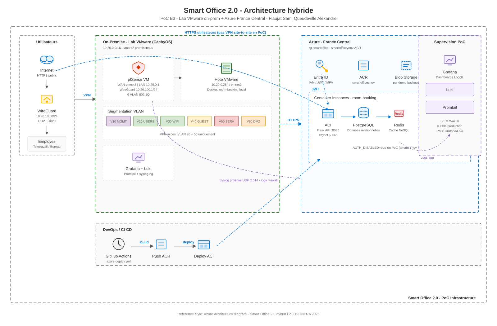

# Ynov B3 INFRA - Projet Smart Office 2.0

## Présentation du Projet

**Formation:** Ynov Informatique - Bachelor 3 Infrastructure Réseau  
**Sujet:** Smart Office 2.0 — Infrastructure Réseau Sécurisée  
**Équipe:** Flaujat Sam, Queudeville Alexandre  
**Période:** 2026  

### Contexte

Conception d'une infrastructure IT hybride pour une startup biotechnologie (50 → 200 employés, siège 4 étages, télétravail flexible).

**Index des livrables :** [docs/README.md](docs/README.md) · **Tableau Trello :** [b3-infra](https://trello.com/b/EXl0H0QS/b3-infra)

---

## Structure du Dépôt

```text
ynov-b3-infra/
├── cloud/
│   └── room-booking/         # PoC réservation de salles
├── docs/                     # Tous les livrables UF_INFRA_B3
│   ├── README.md             # Index et statut des documents
│   ├── DAT.md                # Dossier d'Architecture Technique
│   ├── architecture/         # Schémas, IP/VLAN, screenshots réseau
│   ├── security/             # Zero Trust, IAM, firewall
│   ├── database/             # Merise, backup/restore
│   ├── pca_pra/              # BIA, PCA, PRA
│   └── project_management/   # ITSM, backlog, Trello
├── infra/network/            # pfSense, VMware (fait)
├── monitoring/               # Grafana/Loki/Promtail
└── .github/workflows/        # azure-deploy.yml → ACR
```

---

## Architecture hybride



Schéma source : [smart_office_hybrid.svg](docs/architecture/smart_office_hybrid.svg)

**Variante Azure-style** (comparaison) : [smart_office_hybrid_azure_style.svg](docs/architecture/smart_office_hybrid_azure_style.svg) · [PNG](docs/architecture/screenshots/smart_office_hybrid_azure_style.png)

**Zones :** télétravail (WireGuard) · lab VMware (pfSense, 6 VLANs, Grafana/Loki) · Azure (ACR, ACI, Entra ID, Blob) · CI/CD GitHub Actions.

---

## Architecture Réseau (VLANs)


Schéma source : [network_vlan.svg](docs/architecture/network_vlan.svg) — **réseau on-prem uniquement** (pfSense, 6 VLANs, VPN) · draw.io : [network diagram.xml](docs/architecture/network%20diagram.xml)

- [Plan d'Adressage IP & VLAN](docs/architecture/Plan_Adressage_IP_VLAN.md)
- [Installation pfSense](infra/network/pfsense_initial_setup.md)
- [Configuration VLANs](infra/network/pfsense_vlan_config.md)
- [VMware vmnet2](infra/network/vmware_vmnet2_config.md)
- [VPN WireGuard — VLAN20/50](infra/network/pfsense_wireguard_vpn.md)

---

## Stack Technique

| Catégorie | Outils |
|-----------|--------|
| **Réseau** | pfSense 2.7+, 6 VLANs 802.1Q, 10.20.0.0/16 |
| **Virtualisation** | VMware Workstation |
| **Cloud** | Azure France Central — ACR `smartofficeynov`, ACI déployé |
| **IAM** | Microsoft Entra ID (code prêt, portail Ynov limité) |
| **App** | Docker, Flask, PostgreSQL, Redis |
| **CI/CD** | GitHub Actions → ACR |
| **Monitoring** | Grafana, Loki, Promtail |

---

## Room Booking Service

PoC cloud — réservation de salles (API complète, déployée sur ACI).

**URL publique :** http://ynov-smartoffice-b3.francecentral.azurecontainer.io:8080

```bash
cd cloud/room-booking
docker compose up --build
curl http://localhost:8080
```

Détails : [cloud/room-booking/DETAILS.md](cloud/room-booking/DETAILS.md)

**Pipeline :** `GitHub → ACR → ACI → Utilisateurs (Entra ID)`

---

## Monitoring (PoC local)

```bash
cd monitoring && docker compose up -d
# Grafana http://localhost:3000 — admin / smartoffice
```

Détails et scénario d'anomalie : [monitoring/README.md](monitoring/README.md)

---

## Contribution

1. `git checkout -b feature/nom-descriptif`
2. `git commit -m 'feat: description'`
3. `git push origin feature/nom-descriptif`
4. Ouvrir une Pull Request
