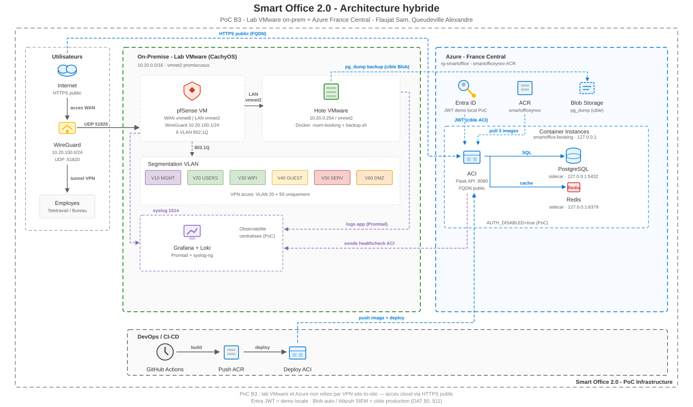

# Ynov B3 INFRA - Projet Smart Office 2.0

## Présentation du Projet

**Formation:** Ynov Informatique - Bachelor 3 Infrastructure Réseau  
**Sujet:** Smart Office 2.0 — Infrastructure Réseau Sécurisée  
**Équipe:** Flaujat Sam, Queudeville Alexandre  
**Période:** 2026  

### Contexte

Conception d'une infrastructure IT hybride pour une startup biotechnologie (50 → 200 employés, siège 4 étages, télétravail flexible).

**Documentation complète :** [ci-dessous](#documentation) · **Tableau Trello :** [b3-infra](https://trello.com/b/EXl0H0QS/b3-infra)

---

## Structure du Dépôt

```text
ynov-b3-infra/
├── cloud/
│   └── room-booking/         # PoC réservation de salles (Flask, PostgreSQL, Redis)
├── docs/                     # Tous les livrables UF_INFRA_B3
│   ├── README.md             # Index et statut des documents
│   ├── DAT.md                # Dossier d'Architecture Technique
│   ├── architecture/         # Schémas, IP/VLAN, screenshots PoC
│   ├── security/             # Zero Trust, IAM Entra, firewall
│   ├── database/             # Merise, backup/restore
│   ├── pca_pra/              # BIA, PCA, PRA
│   └── project_management/   # ITSM, backlog, captures Trello
├── infra/
│   ├── network/              # pfSense, VMware, WireGuard, syslog
│   └── azure/                # ACI, container-group, déploiement
├── monitoring/               # Grafana, Loki, Promtail, health-prober
└── .github/workflows/        # azure-deploy.yml → ACR → ACI
```

---

## Architecture hybride



On-prem (pfSense, VLANs, WireGuard, Grafana/Loki) + Azure France Central (ACI, ACR, Entra ID) + CI/CD GitHub Actions.

Description détaillée : [docs/DAT.md §5](docs/DAT.md#5-architecture-hybride-on-premise--cloud)

---

## Architecture Réseau (VLANs)


- [Plan d'Adressage IP & VLAN](docs/architecture/Plan_Adressage_IP_VLAN.md)
- [Installation pfSense](infra/network/pfsense_initial_setup.md)
- [Configuration VLANs](infra/network/pfsense_vlan_config.md)
- [VMware vmnet2](infra/network/vmware_vmnet2_config.md)
- [VPN WireGuard — VLAN20/50](infra/network/pfsense_wireguard_vpn.md)

---

## Stack Technique

| Catégorie | Outils |
|-----------|--------|
| **Réseau** | pfSense 2.7+, 6 VLANs 802.1Q, 10.20.0.0/16 |
| **Virtualisation** | VMware Workstation |
| **Cloud** | Azure France Central — ACR `smartofficeynov`, ACI déployé |
| **IAM** | Microsoft Entra ID (JWT + MSAL ; démo **locale** `localhost:8080/login`) |
| **App** | Docker, Flask, PostgreSQL, Redis |
| **CI/CD** | GitHub Actions → ACR |
| **Monitoring** | Grafana, Loki, Promtail |

---

## Room Booking Service

PoC cloud — réservation de salles (API complète, déployée sur ACI).

<table>
<colgroup>
<col style="width:32%">
<col style="width:30%">
<col style="width:38%">
</colgroup>
<thead>
<tr><th>Accès</th><th>URL</th><th>Auth</th></tr>
</thead>
<tbody>
<tr>
<td><span style="white-space:nowrap"><strong>ACI&nbsp;public</strong></span><br>(PoC&nbsp;cloud)</td>
<td>http://ynov-smartoffice-b3.francecentral.azurecontainer.io:8080</td>
<td><code>AUTH_DISABLED=true</code> (HTTP — Entra SPA exige HTTPS hors localhost)</td>
</tr>
<tr>
<td><span style="white-space:nowrap"><strong>Local&nbsp;+&nbsp;Entra&nbsp;ID</strong></span><br>(démo&nbsp;IAM)</td>
<td>http://localhost:8080/login</td>
<td>JWT Microsoft (tenant dev personnel)</td>
</tr>
</tbody>
</table>

```bash
cd cloud/room-booking
docker compose --env-file .env up --build   # Entra : docs/security/entra_portal_setup.md
curl http://localhost:8080/health
curl http://ynov-smartoffice-b3.francecentral.azurecontainer.io:8080/health
```

Détails : [cloud/room-booking/DETAILS.md](cloud/room-booking/DETAILS.md)

**Pipeline :** `GitHub → ACR → ACI` (cloud) · Entra ID démontré en local

---

## Monitoring (PoC local)

```bash
cd monitoring && docker compose up -d
# Grafana http://localhost:3000 — admin / smartoffice
```

Détails : [monitoring/README.md](monitoring/README.md) · [Scénario d'anomalie](monitoring/anomaly-scenario.md)

---

## Documentation

Index des livrables UF_INFRA_B3 (statut **Fait**) : [docs/README.md](docs/README.md)

### Architecture & DAT

- [DAT.md](docs/DAT.md) — Dossier d'Architecture Technique (document principal)
- [Plan d'adressage IP & VLAN](docs/architecture/Plan_Adressage_IP_VLAN.md) — Segmentation `10.20.0.0/16`, 6 VLANs
- [Captures PoC réseau & cloud](docs/architecture/screenshots/) — Schémas PNG, Grafana, VPN, backup, ACI
- [Édition schéma SVG](docs/architecture/EDITING.md) — Guide mise à jour du diagramme hybride

### Sécurité & IAM

- [Zero Trust & IAM](docs/security/Zero_Trust_IAM.md) — Modèle Zero Trust, rôles, MFA
- [Configuration Entra ID](docs/security/entra_portal_setup.md) — Portail Azure, MSAL, JWT, démo locale
- [Politiques firewall](docs/security/firewall_policies.md) — Règles pfSense inter-VLAN et WAN

### Base de données & continuité

- [MCD Merise](docs/database/MCD_Merise.md) — Modèle conceptuel room-booking
- [Backup & restore](docs/database/backup_restore.md) — `pg_dump`, procédure de restauration
- [BIA](docs/pca_pra/BIA.md) — Analyse d'impact métier
- [PCA / PRA](docs/pca_pra/PCA_PRA.md) — Continuité et reprise d'activité

### Gestion de projet

- [ITSM](docs/project_management/ITSM.md) — Gestion des incidents
- [Backlog & sprints](docs/project_management/backlog_sprints.md) — Méthodologie agile, user stories
- [Captures Trello](docs/project_management/screenshots/) — Screenshots du tableau b3-infra
- [Trello b3-infra](https://trello.com/b/EXl0H0QS/b3-infra) — Board Kanban (lien externe)

### Réseau on-premise

- [Installation pfSense](infra/network/pfsense_initial_setup.md) — Première configuration
- [Configuration VLANs](infra/network/pfsense_vlan_config.md) — 802.1Q, interfaces, règles
- [VMware vmnet2](infra/network/vmware_vmnet2_config.md) — Lab LAN `10.20.0.0/16`
- [VPN WireGuard](infra/network/pfsense_wireguard_vpn.md) — Accès VLAN20/50 à distance
- [pfSense → Loki](infra/network/pfsense_syslog_loki.md) — Syslog vers monitoring

### Cloud & déploiement

- [Room-booking — détails](cloud/room-booking/DETAILS.md) — API, stack, endpoints, tests
- [Déploiement Azure ACI](infra/azure/aci-deploy.md) — ACR, container group, pipeline

### Monitoring

- [Stack Grafana / Loki](monitoring/README.md) — Déploiement, dashboard, health-prober
- [Scénario d'anomalie](monitoring/anomaly-scenario.md) — Détection incident PoC

---

## Contribution

1. `git checkout -b feature/nom-descriptif`
2. `git commit -m 'feat: description'`
3. `git push origin feature/nom-descriptif`
4. Ouvrir une Pull Request
