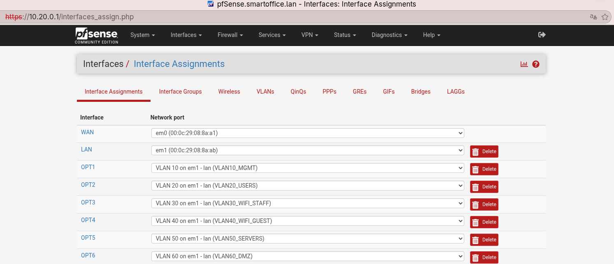

# 🔌 Configuration des VLANs - pfSense

Cette documentation détaille la segmentation réseau (VLANs) configurée sur l'interface LAN de pfSense.

## 📋 Tableau des VLANs

| VLAN ID | Nom | Interface | Sous-réseau | IP Gateway | Description |
| :---: | :--- | :---: | :--- | :--- | :--- |
| **10** | `MGMT` | `em1.10` | `10.20.10.0/24` | `10.20.10.1` | Gestion équipements |
| **20** | `USERS` | `em1.20` | `10.20.20.0/24` | `10.20.20.1` | Utilisateurs (Bureau) |
| **30** | `WIFI_STAFF` | `em1.30` | `10.20.30.0/24` | `10.20.30.1` | Wi-Fi Personnel |
| **40** | `WIFI_GUEST` | `em1.40` | `10.20.40.0/24` | `10.20.40.1` | Wi-Fi Invités |
| **50** | `SERVERS` | `em1.50` | `10.20.50.0/24` | `10.20.50.1` | Serveurs internes |
| **60** | `DMZ` | `em1.60` | `10.20.60.0/24` | `10.20.60.1` | Services exposés |

## ⚙️ Paramètres de l'Interface Parente

- **Interface Physique:** `em1` (LAN)
- **Adresse MAC:** `00:0c:29:08:8a:ab`
- **Protocole Trunk:** 802.1Q (Dot1Q)

## 📸 Capture de Configuration

---
**Notes :**
- Les règles de firewall doivent быть appliquées individuellement sur chaque interface VLAN.
- L'interface parenте (em1) ne doit pas avoir d'IP assignée si tout le trafic est taggué.